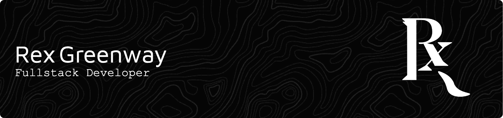

  

    <!-- Languages -->
    
    
    
    
    <!-- Non-breaking Space -->
    &nbsp;&nbsp;&nbsp;&nbsp;&nbsp;&nbsp;&nbsp;&nbsp;&nbsp;&nbsp;
    <!-- Frameworks -->
    
    
    
    
    
    
    
  

 

  <b>Website:<b/> <a href="https://rexgreenway.github.io">rexgreenway.github.io</a>
  &nbsp;&nbsp;&nbsp;&nbsp;
  <b>Email:<b/> <a href="mailto: rexgreenway@gmail.com">rexgreenway@gmail.com</a>

<!--
**RexGreenway/RexGreenway** is a ✨ _special_ ✨ repository because its `README.md` (this file) appears on your GitHub profile.

Here are some ideas to get you started:

- 🔭 I’m currently working on ...
- 🌱 I’m currently learning ...
- 👯 I’m looking to collaborate on ...
- 🤔 I’m looking for help with ...
- 💬 Ask me about ...
- 📫 How to reach me: ...
- 😄 Pronouns: ...
- ⚡ Fun fact: ...
-->
